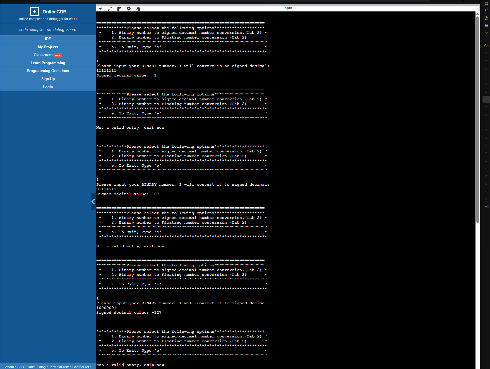
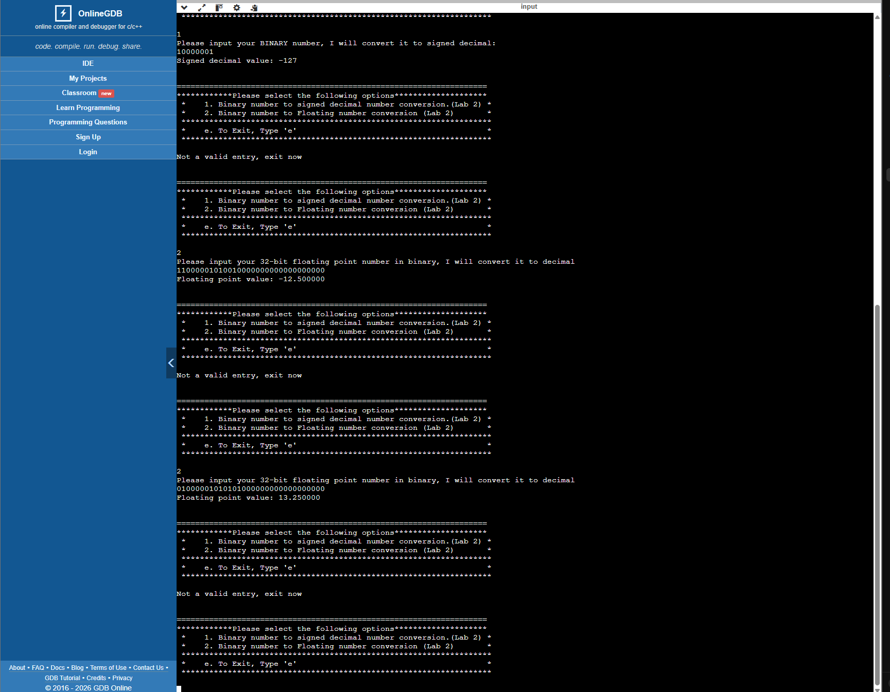
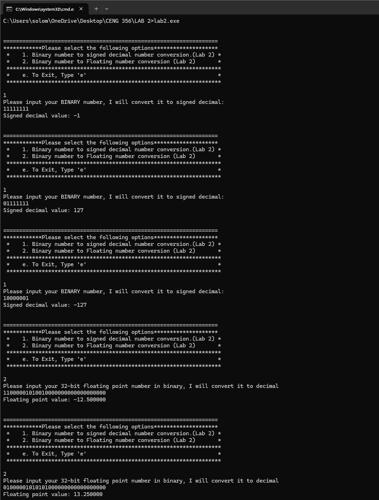
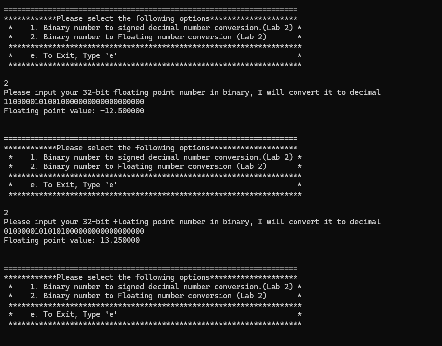

# CENG 356 - Lab 2: Floating-Point Number Conversions

**Student:** Solomon Ewusi
**Student ID:** N01659373
**Course:** CENG 356 - Computer Systems Architecture
**Institution:** Humber College

---

## Overview

This lab implements two manual bit-level conversions in C, without using any string-to-number library functions (`atoi`, `strtol`, `atof`, `sscanf`, etc.):

1. **Option 1** — converts an 8-bit binary string into a signed decimal number using two's complement.
2. **Option 2** — converts a 32-bit binary string into an IEEE-754 floating-point decimal number.

Both were tested on two platforms: onlinegdb.com (online compiler) and a local PC (MinGW GCC).

---

## Files

| File | Description |
|------|-------------|
| `lab2.c` | Source code with `convert_binary_to_signed()` and `convert_binary_to_float()`, plus the professor's starter menu code |

---

## Features Implemented

### 1. Binary to Signed Decimal (`convert_binary_to_signed`)
- Reads an 8-bit binary string
- Applies two's complement: the leftmost bit is worth **-128**, every other bit is worth its normal positive power of 2
- Prints the resulting signed decimal value

### 2. Binary to IEEE-754 Float (`convert_binary_to_float`)
- Reads a 32-bit binary string and splits it into sign (1 bit), exponent (8 bits), and mantissa/fraction (23 bits)
- Unbiases the exponent by subtracting 127
- Reconstructs the fraction from the 23 mantissa bits, adds the implied leading 1
- Combines sign, mantissa, and exponent using `(-1)^sign × mantissa × 2^(exponent - 127)`
- Prints the resulting floating-point value

---

## How to Compile & Run

### Requirements
- GCC (MinGW for Windows) or any standard C compiler
- Link the math library (`-lm`) since `pow()` is used

### Compile
```
gcc lab2.c -o lab2.exe -lm
```

### Run
```
lab2.exe
```

Then choose an option from the menu: `1` for signed decimal conversion, `2` for floating-point conversion, or `e` to exit.

---

## Results

### Option 1 — Binary to Signed Decimal

| Input | Expected | Result |
|---|---|---|
| `11111111` | -1 | -1 ✓ |
| `01111111` | 127 | 127 ✓ |
| `10000001` | -127 | -127 ✓ |

### Option 2 — Binary to IEEE-754 Float

| Input | Expected | Result |
|---|---|---|
| `11000001010010000000000000000000` (number1) | -12.5 | -12.500000 ✓ |
| `01000001010101000000000000000000` (number2) | 13.25 | 13.250000 ✓ |

All results matched on both onlinegdb.com and the local PC (MinGW).

---

## Screenshots

### Option 1 test cases (Online Compiler — OnlineGDB)


### Option 2 test cases (Online Compiler — OnlineGDB)


### Options 1 and 2 test cases (Local PC — MinGW)


### Option 2 test cases, close-up (Local PC — MinGW)


### Novabench — Overall, CPU, and GPU results


### Novabench — Memory and Storage results


---

## Notes

- The two's complement formula treats the leftmost bit as worth -128 instead of +128 — that single sign-weighted bit is what allows negative numbers to be represented and added using the same binary addition circuit as positive numbers.
- IEEE-754 floats store an implied leading 1 in the mantissa that is never written in the bit pattern, so the fraction bits must have 1.0 added back before multiplying by the exponent.
- The `fflush(stdin)` pattern in the professor's starter code does not reliably clear the input buffer on all compilers — this occasionally caused a harmless "Not a valid entry" message between menu selections on onlinegdb.com, but did not affect the correctness of any results. It did not occur on the local MinGW compiler.

---

## GitHub Repository
[https://github.com/SolomonEwusi9373/SolomonEwusiCENG356-Lab2](https://github.com/SolomonEwusi9373/SolomonEwusiCENG356-Lab2)
